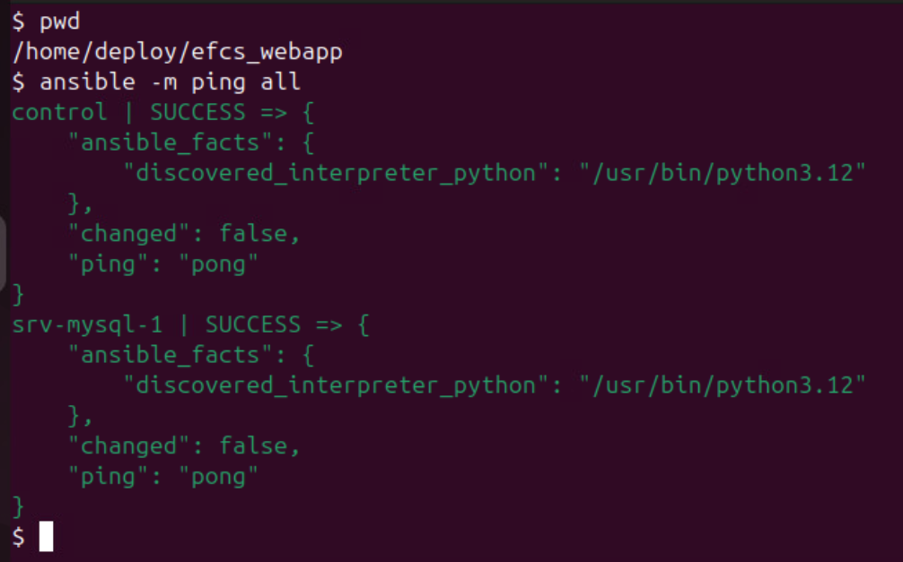
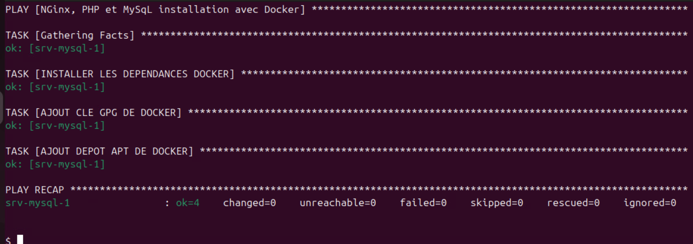
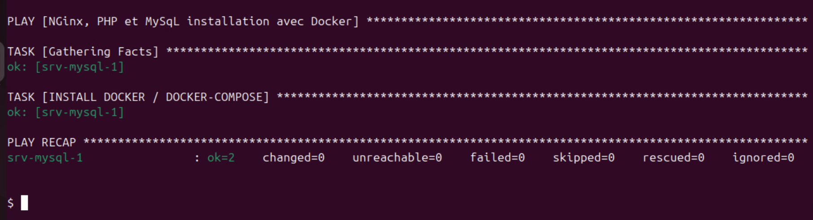
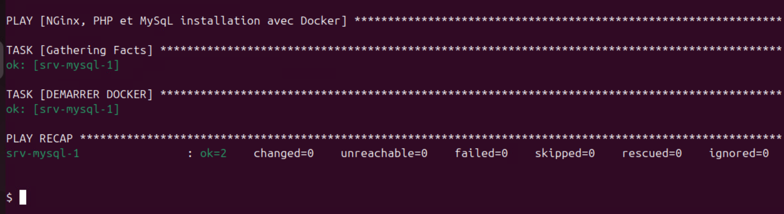
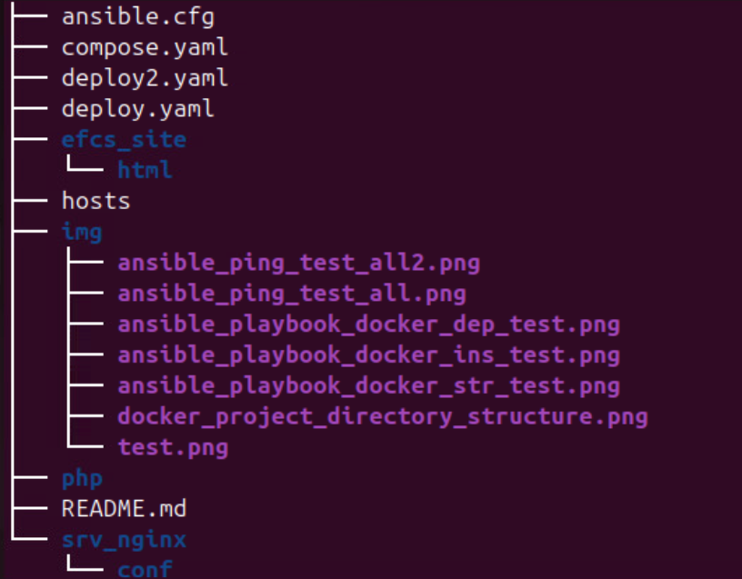
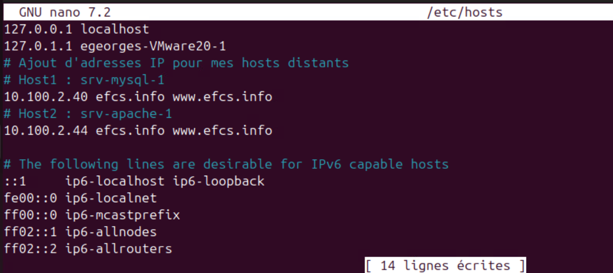

# Webapp-ansible-nginx-php-mysql

## Description du projet
Ce travail s'effectue dans le contexte d'une évaluation à caractère synthèse. Il consiste à automatiser des tâches avec l'utilisation de Ansible pour installer des outils et des containers Docker et déployer une application web sur un server distant. L'application web utilise un proxy Nginx qui fait circuler le trafic en provenance d'un server web en PHP qui communique avec un server de base de données MySQL. Pour effectuer ce travail, nous faisons usage d'un poste de gestion déjà configuré sur lequel des outils tels que Ansible et SSH sont déjà installés. Les tâches à réaliser seront effectuées dupuis notre poste de gestion, qui controlera la machine distante via des connexions ssh. Et le serveur distant que nous utilisaons est le (srv-mysql-1). 

## Les étapes du projet

<h3>1 - Mise en place des fichier préliminaires de Ansible</h3>
- Sur notre poste de gestion, nous travaillons avec l'utilisateur 'deploy', conçu à cet effet. Nous avons préparé un répertoire pour le projet (efcs_webapp) dans l'espace de travail de 'deploy' et le dépôt git a été initialisé. Nous y avons ensuite copié un fichier de configuration ansible 'ansible.cfg' que nous avions préalablement placé dans le répertoire home de 'deploy' pour permetre à Ansible de prendre en charge notre répertoire. La copie de ce fichier a été réalisé avec la commande suivante : <br>
```bash
cp ansible.cfg efcs_webapp/
```

- Nous poursuivons avec la création d'un fichier d'inventaire ansible dans le répertoire du projet. Ce fichier d'inventaire appelé 'hosts' a  le contenu initial suivant : <br>
```bash
nano hosts
# Contenu du fichier d'inventaire 'hosts'...

[Web]
srv-mysql-1 ansible_host=10.100.2.40

[local]
control ansible_connection=local
``` 

- Les fichiers de configuration ansible étant mis en place, nous allons tester la connexion ssh sans mot-de-passe. Pour ce faire, nous nous servirons du module ping de ansible. La commande que nous utiliserons la commande suivante : <br>
```bash
# Tester seulement le noeud 'Web'
ansible -m ping Web 
# Tester tous les noeuds ('all)'
ansible -m ping all
``` 
**Figure 01 : Test de vérification de connexion au serveur**<br>



<h3>2 - Création du playbook Ansible</h3>
Pour mettre en place le playbook ansible, nous allons créer un fichier initial nommé 'deploy.yaml'. Dans cette version du fichier, les tâches sont définies en trois groupes : l'installation des dépendances de Docker, l'installation de Docker et Docker-compose et le démarrages de Docker.<br>
- <h4>Installation des dépendances de Docker : </h4>
Comme le nom l'indique, cette partie prend en charge les dépendances de Docker. On notera qu'il y a essentiellement trois tâches dans cette partie. A ce niveau, le contenu du playbook est tel que suit :

```bash
nano deploy.yaml

# Playbook : deploy.yaml

# Contenu du fichier 

---
- name: "NGinx, PHP et MySqL installation avec Docker"
  hosts: Web
  become: true
  vars:
    ansible_sudo_pass: "egeorges*1"
  tasks:
    - name: INSTALLER LES DEPENDANCES DOCKER
      apt:
        name:
          - apt-transport-https
          - ca-certificates
          - curl
          - software-properties-common
        state: present
        update_cache: yes
      tags: docker-dep

    - name: AJOUT CLE GPG DE DOCKER
      apt_key:
        url: https://download.docker.com/linux/ubuntu/gpg
        state: present
      tags: docker-dep

    - name: AJOUT DEPOT APT DE DOCKER
      apt_repository:
        repo: deb [arch=amd64] https://download.docker.com/linux/ubuntu jammy stable
        state: present
      tags: docker-dep

```

**Figure 02 : Test de vérification des dépendances de Docker**<br>


- <h4>Installation de Docker et Docker-Compose : <h4>
Une fois les dépendances de Docker mises en place, nous sommes en mesure de procéder à l'installation de docker et de docker-compose. Il n'y a qu'une tâche associée à cette partie et le code suivant réprsente la portion du playbook relative à ses activités : <br>

```bash

    - name: INSTALL DOCKER / DOCKER-COMPOSE
      apt:
        name:
          - docker-ce
          - docker-compose-plugin
        state: present
        update_cache: yes
      tags: docker-ins

```

**Figure 03 : Test d'installation Docker et docker-compose**<br>


- <h4>Demarrage de Docker : </h4>
Les tâches exécutées dans cette partie procèdent au démarrage du service de docker. Au final, nous avons une seule tâche incluse pour prendre en charge cette activité. Voici la portion de code du playbook qui y est associée : <br> 

```bash

    - name: DEMARRER DOCKER
      ansible.builtin.systemd_service:
        state: started
        name: docker
      tags: docker-str

```

**Figure 04 : Test de démarrage de Docker**<br>



Voici le contenu intégral de la version finale du playbook (jusqu'à ce niveau du projet).

```bash
 Playbook : deploy.yaml

# Contenu du fichier 

---
- name: "NGinx, PHP et MySqL installation avec Docker"
  hosts: Web
  become: true
  vars:
    ansible_sudo_pass: "egeorges*1"
  tasks:
    - name: INSTALLER LES DEPENDANCES DOCKER
      apt:
        name:
          - apt-transport-https
          - ca-certificates
          - curl
          - software-properties-common
        state: present
        update_cache: yes
      tags: docker-dep

    - name: AJOUT CLE GPG DE DOCKER
      apt_key:
        url: https://download.docker.com/linux/ubuntu/gpg
        state: present
      tags: docker-dep

    - name: AJOUT DEPOT APT DE DOCKER
      apt_repository:
        repo: deb [arch=amd64] https://download.docker.com/linux/ubuntu jammy stable
        state: present
      tags: docker-dep

    - name: INSTALL DOCKER / DOCKER-COMPOSE
      apt:
        name:
          - docker-ce
          - docker-compose-plugin
        state: present
        update_cache: yes
      tags: docker-ins

    - name: DEMARRER DOCKER
      ansible.builtin.systemd_service:
        state: started
        name: docker
      tags: docker-str

```

<h3>3 - Déploiement du projet avec Docker compose </h3>

<h4>- Mise en place de la structure du projet </h4>
Le point essentiel dans cette étape consiste à créer le fichier d'orchestration. Mais juste avant, nous allons créer les dossier nécessaires pour mettre en place la structure du projet. Nous nous positionnerons dans le dossier racine du projet : efcs_webapp.C'est d'ailleurs l'espace où a été créé le playbook. Nous allons créer 4 dossiers principaux : 'efcs_site', 'mysql', 'php' et 'srv_nginx'. Un dossier html sera créé à l'intérieur de efcs_site tandis qu'un autre dossier 'conf' sera  à son tour dans srv_nginx. Les commandes à exécuter sont les suivantes : 

```bash
# Créer le dossier 'html' dans le efcs_site/. 
# Avec le paramètre '-p', le dossier parent (efcs_site) sera créé aussi au cas où il n'existe pas. 
mkdir -p efcs_site/html

# Créer le dossier 'mysql' dans le dossier courant.
mkdir mysql

# Créer le dossier 'php' dans le dossier courant.
mkdir php

# Créer le dossier 'conf' dans le dossier srv_nginx. 
# Comme pour le premier cas, le paramètre '-p' va forcer la création du dossier parent (srv_nginx) au cas où il n'existe pas.
mkdir -p srv_nginx/conf

```
Plus tard, nous aurons à créer les fichiers 'index.html' et index.php dans le répertoire efcs_site/html/. Nous aurons aussi besoin d'un fichier 'default.conf' dans srv_nginx/conf/ 
Une fois ces commandes exécutées, nous avons une structure qui ressemble à la figure ci-après.

**Figure 05 : Présentation de la tructure du projet**<br>



<h4>- Création du fichier d'orchestration 'compose.yaml' </h4>
Maintenant que notre structure est mise en place, nous pourrons poursuivre avec la création du fichier 'compose.ymal'. La version initiale de ce fichier d'orchestration est définie par le contenu suivant.

```bash
#  Contenu du fichier 'compose.yaml'

---
services:

  proxy:
    image: nginx:latest
    build: './efcs_site/'
    networks:
    depends_on:
      - php
    ports:
      - "80:80"
    volumes:
      - ./srv_nginx/conf/default.conf:/etc/conf.d/default.conf

  php:
    image: php:8.2 FPF
    build: './php/'
    networks:
      - backend
      - frontend
    ports:
      - '9000:9000'
    volumes:
      - ./efcs_site/html/:usr/local/srv_nginx/htdocs/

  mysql:
    image: mysql:latest
    build: './mysql/'
    networks:
      - net_data
    ports:
      - '3306:3306'
    volumes:
      - ./efcs_site/html/:usr/local/srv_nginx/htdocs/

  volumes:
    - ./efcs_site/html/:usr/local/srv_nginx/htdocs/

  networks:
    backend:
    frontend:
    net_data:

```

<h4>- Mise en place de variables d'environnement </h4>
Nous ferons usage de certaines variables qui nous servirons pour la connexion à la bd. Dans la configuration de MySQL et PHP, nous utiliserons quelques-uns (ex: DB_USERNAME, DB_PASSWORD ou MYSQL_ROOT_PASSWORD) pour la connexion à la base de données'. Nous allons aussi modifier le fichier 'compose.yaml' pour y ajouter un volume pour la persistence de données. La version finale du fichier compose.yaml reflète de tels changements.

# <h4>- Modification du fichier /etc/hosts </h4>
À présent, le poste local de gestion doit être configuré pour qu'un client, tel qu'un navigateur, puisse reconnaître les noms de domaine du site lors d'une requête http. Pour cela, nous allons modifier le fichier hosts du répertoire /etc/ de notre machine de gestion. Nous allons y ajouter l'adresse IP de la machine qui va rouler le site. Et à cette adresse IP, nous devons aussi associer le nom de domaine du site (dans notre cas :<a href='efcs.com'>efcs.info</a> et www.efcs.info). Avec l'éditeur de texte nano, la commande suivante nous permet d'ouvrir le fichier hosts pour de telles modifications.

```bash
nano /etc/hosts
# Ligne à ajouter pour notre site : 
10.100.2.40 efcs.info www.efcs.info

```
**Figure 06 : Fichier /etc/hosts après modifications**<br>


<h3>4 - Configuration du site</h3>

<h4>- Création du fichier de configuration de Nginx</h4>
Notre fichier de configuration Nginx aura le contenu suivant.Précisément, nous nous positionnons dans le répertoire efcs_site/conf/, qui est à l'intérieur du dossier de travail. Notre fichier de configuration Nginx aura le contenu suivant.

```bash

# Créer le fichier
nano default.conf

# Contenu du fichier 'default.conf'
server {
    listen       80;
    listen  [::]:80;
    server_name  efcs.info www.efcs.info;

    #access_log  /var/log/nginx/host.access.log  main;

    root   /usr/share/nginx/html;
    index  index.php index.html index.htm;

    location / {
        try_files $uri $uri/ /index.php?$query_string;
    }

    #error_page  404              /404.html;

    # redirect server error pages to the static page /50x.html
    error_page   500 502 503 504  /50x.html;
    location = /50x.html {
        root   /usr/share/nginx/html;
    }
    
    # PHP-FPM Configuration pour php
    location ~\.php$ {
        try_files $uri = 404;
        fastcgi_split_path_info ^(.+\.php)(/.+)$;
        fastcgi_pass php:9000;
        fastcgi_index index.php;
        include fastcgi_params;
        fastcgi_param REQUEST_URI $request_uri;
        fastcgi_param SCRIPT_FILENAME $document_root$fastcgi_script_name;
        fastcgi_param PATH_INFO $fastcgi_path_info;
    }

    # deny access to .htaccess files
    #location ~ /\.ht {
    #    deny  all;
    #}
}

```

<h4>- Création d'un fichier PHP</h4>
Rendu ici, nous allons créer un fichier index.php dans le répertoire 'efcs_site/html/' de notre structure. Ce fichier nous permettra entre autre de vérifier si la connexion à la BD via PHP est bel et bien réussie ou non.
pour faire simple, on se positionne dans ce répertoire. Voici le contenu pour notre fichier 'index.php'.

```bash
# Pour créer le fichier 'index.php
nano index.php

<!-- Contenu de index.php -->
<h1>Je teste mon site !</h1>
<h4>Tentative de connexion au serveur MySQL depuis PHP...</h4>
<?php
$db_host = 'mysql';
$db_user = $_ENV["DB_USERNAME"];
$db_pass = $_ENV["DB_PASSWORD"];
$conn = new mysqli($db_host, $db_user, $db_pass);

if ($conn->connect_error) {
    die("La connexion a échoué: " . $conn->connect_error);
}
echo "Connexion réussie à MySQL !";
?>

```

<h4>- Détails additionnels : prise en charges des volumes et autres</h4>
À cette étape précise, notons que tous les éléments sont en place pour faire rouler notre site sur notre poste local. Nous avons plusieurs montages dans notre structure pour prendre en charges les volumes. Notre fichier d'orchestration 'compose.yaml' fait bien état, entre autres, d'un volume de stockage que nous utilisons avec le service 'mysql' pour persister les données de la BD. Plûtôt que d'utiliser une image pour PHP dans le compose.yaml, nous avons créé un fichier Dockerfile pour gérer cet aspect du travail. Ce fichier est dans le dossier 'php/' qui réside dans le répertoire du projet. En voici le contenu : 

```bash

# Dockerfile
# Utilise une petite image
FROM php:fpm-alpine

# Mets a jour le serveur
RUN apk update; \
    apk upgrade;

# Install mysqli extension  permettant d'utiliser la bd dans PHP
RUN docker-php-ext-install mysqli

```
